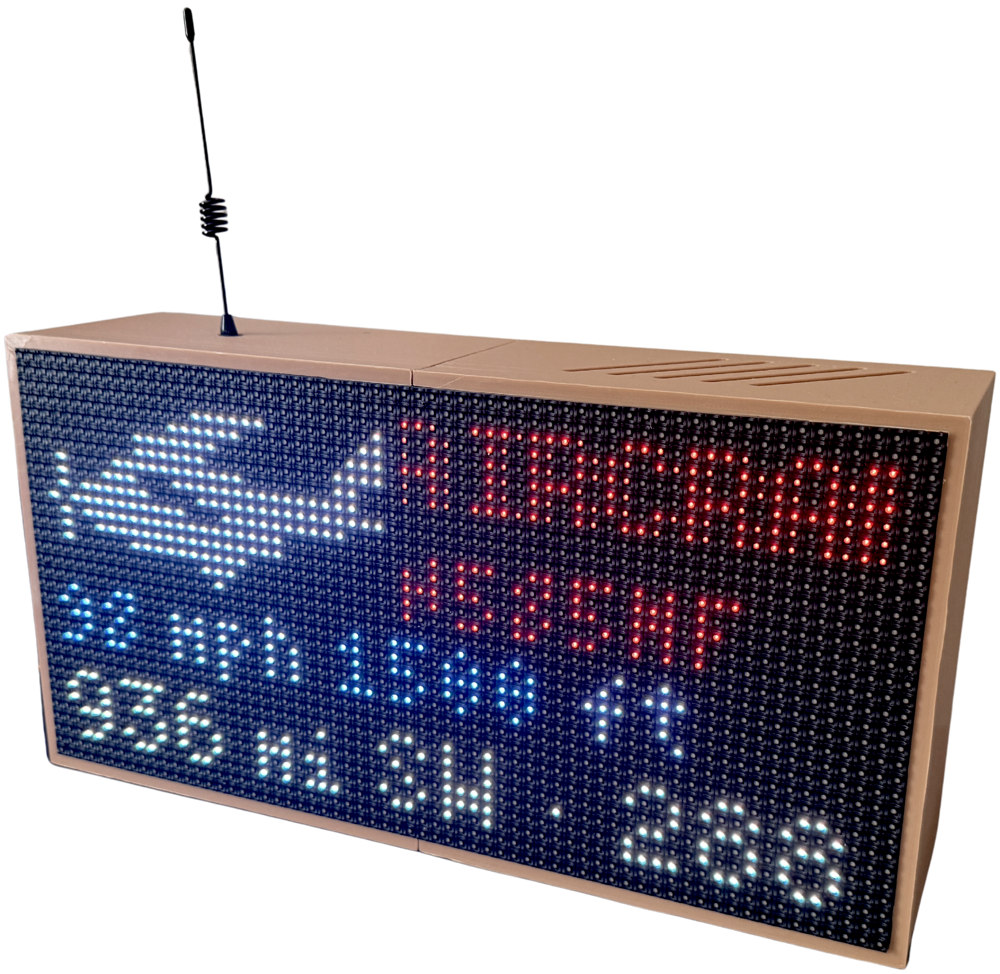
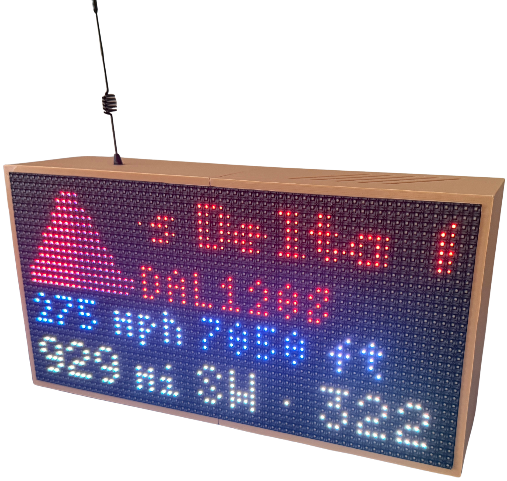

# FltCast

FltCast is a C++ ADS-B flight tracker built for Raspberry Pi and HUB75 RGB LED matrices.

It reads SBS aircraft data from port `30003`, selects the nearest aircraft, enriches the data with a local DB lookup, and renders it to the LED matrix.

FltCast is designed to work with an RTL-SDR and any ADS-B decoder that provides an SBS/BaseStation-compatible stream, such as `dump1090-fa`.

<p align="center">
  
  &nbsp;&nbsp;&nbsp;&nbsp;
  
</p>

## Parts List

*As an Amazon Associate, I earn from qualifying purchases.*

- [RTL-SDR](https://amzn.to/47ngHxq)
- [32x64 LED Matrix](https://amzn.to/4rCTnoO)
- [RGB Matrix Adapter Board](https://amzn.to/4hwtSAM)
- [HUB75 RGB LED Matrix](https://amzn.to/3TtoiXR)
- [USB-C Pigtail Cables](https://amzn.to/4iXFlMl)
- [Raspberry Pi 4](https://amzn.to/4xKLPBJ)
- [WAGO 221-413 Lever Connectors](https://amzn.to/4z2amDs)
- [Case STLs](case)

## Build Guide

A more detailed step-by-step build guide is currently in progress. If you'd like to be notified when it's available, you can [join the waitlist here](https://bytecadia.kit.com/4a5f30c81c).

## Setup

### Disable the Raspberry Pi Audio Kernel Module

The RGB matrix library may conflict with the `snd_bcm2835` audio kernel module.

Check whether it is loaded:

```bash
lsmod | grep snd_bcm2835
```

If it is, unload it:

```bash
sudo modprobe -r snd_bcm2835
```

### Install Dependencies

```bash
sudo apt install git cmake rtl-sdr
```

## Install dump1090-fa

Install the FlightAware repository:

```bash
wget https://www.flightaware.com/adsb/piaware/files/packages/pool/piaware/f/flightaware-apt-repository/flightaware-apt-repository_1.3_all.deb

sudo dpkg -i flightaware-apt-repository_1.3_all.deb
sudo apt update
sudo apt install dump1090-fa
```

Restart and verify the service:

```bash
sudo systemctl restart dump1090-fa
sudo systemctl status dump1090-fa
```

Reboot after installation:

```bash
sudo reboot
```
## Build and Run

```bash
cmake -S . -B build
cmake --build build
```

Run:
 
> **Note:** This may take around 30 seconds to begin displaying. SBS data arrives across several transmissions and needs time to accumulate.

```bash
sudo ./build/flight_cast
```

## Start Service

Write the systemd service file. Update with the location of the repository.
```
[Unit]
Description=FltCast
After=network-online.target dump1090-fa.service
Wants=network-online.target dump1090-fa.service

[Service]
Type=simple
WorkingDirectory=/path/to/fltcast
ExecStart=/path/to/fltcast/build/flight_cast
Restart=on-failure
RestartSec=5
User=root

[Install]
WantedBy=multi-user.target
```

## Configuration

FltCast reads its runtime settings from an INI configuration file. In the repo root as "config.ini". The following are the current config options:

### Network

`host` and `port` define the SBS/BaseStation stream used by FltCast.

For a local `dump1090-fa` installation:

```ini
[network]
host = localhost
port = 30003
```

### Location

Set `lat` and `lon` to the location you're running from. This is used to calculate the planes distance from you.

```ini
[location]
lat = 40.7128
lon = -74.0060
```

### Fonts

(You shouldn't need to mess with these.)

```ini
[font]
sml = 4x6
med = 5x8
lrg = 5x8
```

### Matrix Layout

```ini
[matrix]
cols = 64
rows = 32
padding = 2
row_gap = 0
img_span = 2
img_height = 14
```

## Known Limitations

Some RGB matrix runtime options are currently hard-coded in the application rather than exposed through the configuration file:

```cpp
options.chain_length = 1;
options.parallel = 1;
options.limit_refresh_rate_hz = 300;
options.show_refresh_rate = true;

rgb_matrix::RuntimeOptions runtime_opt;
runtime_opt.gpio_slowdown = 5;
runtime_opt.drop_privileges = -1;
```

These values may need to be changed in source code depending on the matrix hardware and Raspberry Pi configuration. This is temporary and should be moved into the configuration file in a future update. Although if you are using my exact setup there is no need to change this.

## AI Usage

This project was written entirely by hand, with the exception of a few small utility functions. I spent weeks architecting the program from end to end before writing it. 

So if the code is bad, that's all me :)